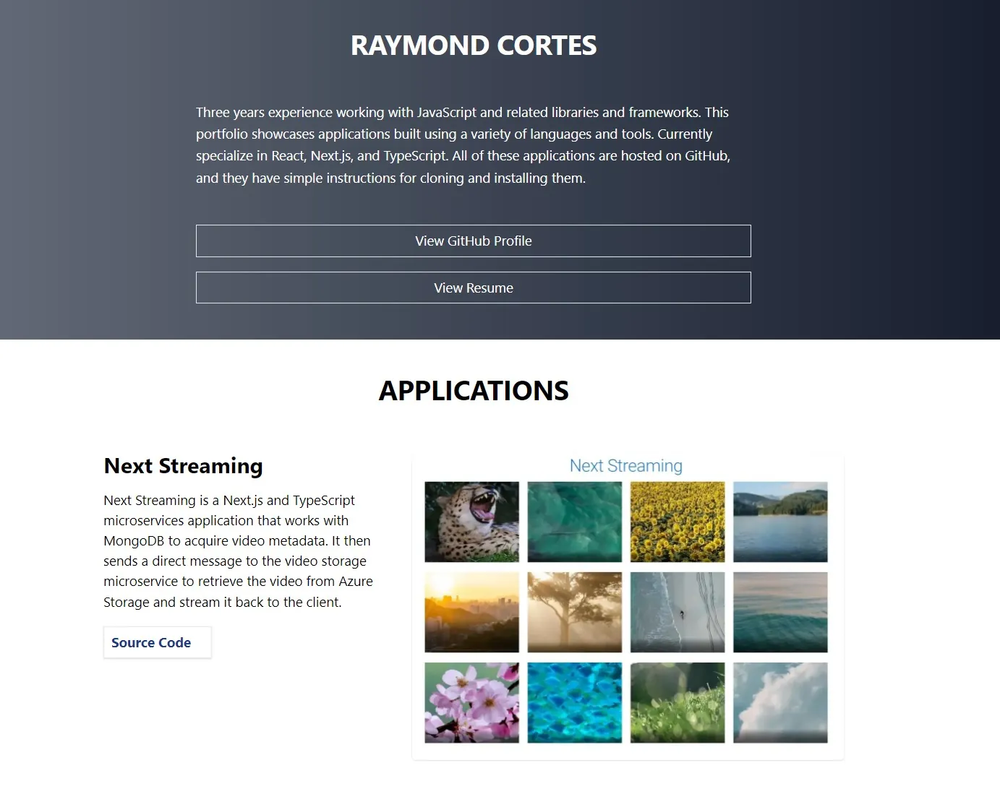

# portfolio-v2

## See the application live [here](https://portfolio-apps.netlify.app/)

A portfolio of applications using React, Next.js, TypeScript, Java, C#, Python, C, Django, HTML, CSS, SCSS, Tailwind CSS, webpack, Babel, and Maven.



---

## Installation Instructions

1. Clone the repo:

```sh
git clone https://github.com/xiraynedev/portfolio-v2.git
```

2. Change directory:

```sh
cd portfolio-v2
```

3. Install packages:

```sh
npm i
```

4. Start the dev server by running:

```sh
npm run dev
```
